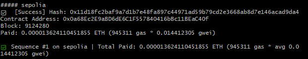
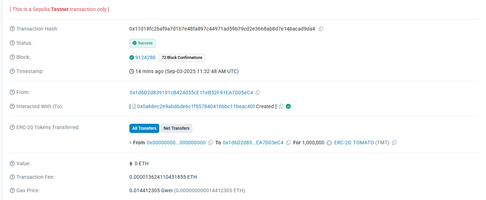

````markdown
# TOMATO (TMT) ERC20 Token on Sepolia

このリポジトリでは **Foundry** と **OpenZeppelin** を使って  
ERC20 トークン **TOMATO (TMT)** を作成し、テストネット **Sepolia** にデプロイする手順をまとめています。

作成した **TOMATO (TMT) トークン** は以下のリンクから確認できます。  

 [Etherscan で確認](https://sepolia.etherscan.io/token/0x99f81904A33b5a40E4EAF8758a0c2FbAB2E658E5)

---

## 🎯 ゴール
- TOMATO (TMT) トークンを作成する  
- Sepolia テストネットにデプロイする  
- デプロイ後にトークン情報を Etherscan で確認できる  

---

##  1. 事前準備

以下の環境を用意してください。

- **Windows + Git Bash** または **WSL**  
  （Linux / macOS の場合は通常の bash でOK）
- **Node.js LTS** （`node -v` で確認）
- **Foundry** （`forge`, `cast`, `anvil` が利用可能な状態）

---

##  2. プロジェクト作成

```bash
# Foundry プロジェクトの雛形を作成
forge init my-project

# プロジェクトディレクトリへ移動
cd my-project

# Git リポジトリを初期化
git init
```
---

## 3. OpenZeppelin ライブラリ導入

```bash
forge install OpenZeppelin/openzeppelin-contracts@v5.0.2
```

### 成功確認

```bash
ls lib | grep openzeppelin-contracts
forge remappings | grep openzeppelin
```

### Foundry プロジェクトの設定ファイル `foundry.toml`を作成

```bash
cat << 'EOF' > foundry.toml
[profile.default]
src = "src"
out = "out"
libs = ["lib"]
solc_version = "0.8.24"
remappings = [
  "@openzeppelin/=lib/openzeppelin-contracts/"
]
EOF
```
---
- `src = "src"`  
  コントラクト（Solidity ファイル）のソースコードを置くフォルダ  

- `out = "out"`  
  コンパイル結果（ABI やバイトコードなど）を出力するフォルダ  

- `libs = ["lib"]`  
  外部ライブラリを配置するフォルダ  

- `remappings`  
  インポートのパス変換ルール  
  例: Solidity のコード内で  
  ```solidity
  import "@openzeppelin/contracts/token/ERC20/ERC20.sol";
  ```  
  と書いたとき、実際には  
  ```
  lib/openzeppelin-contracts/contracts/token/ERC20/ERC20.sol
  ```  
  を参照するようになる  

---

## 4. コントラクト`src/TOMATO.sol`を作成

```bash

cat << 'EOF' > src/TOMATO.sol
// SPDX-License-Identifier: MIT
pragma solidity ^0.8.24;
import "@openzeppelin/contracts/token/ERC20/ERC20.sol";
contract TOMATO is ERC20 {
    constructor() ERC20("TOMATO", "TMT") {
        _mint(msg.sender, 1_000_000 ether);
    }
}
EOF
```
---
## 📖 コード解説

1. `// SPDX-License-Identifier: MIT`  
   - このコードのライセンスを指定  
   - Solidity では SPDX ライセンス表記が必須  

2. `pragma solidity ^0.8.24;`  
   - Solidity コンパイラのバージョンを指定  
   - `^0.8.24` → **0.8.24 以上、0.9.0 未満**  

3. `import "@openzeppelin/contracts/token/ERC20/ERC20.sol";`  
   - OpenZeppelin が提供する **ERC20 標準実装** を読み込む  

4. `contract TOMATO is ERC20`  
   - `TOMATO` というコントラクトを定義  
   - OpenZeppelin の **ERC20** を継承  
   - 継承により「転送」「残高確認」「承認」などの基本機能が自動的に利用可能  

5. `constructor() ERC20("TOMATO", "TMT")`  
   - デプロイ時に実行される **コンストラクタ**  
   - 親クラス `ERC20` のコンストラクタを呼び出し、  
     - トークン名: **"TOMATO"**  
     - シンボル: **"TMT"**  
     を設定  

6. `_mint(msg.sender, 1_000_000 ether);`  
   - デプロイしたアドレス（`msg.sender`）に **100万 TOMATO トークン** を発行  
   - `ether` は ERC20 の最小単位（10^18 wei）を扱うための書き方  
   - 実際には **100万 × 10^18** 単位のトークンを発行することになる  
   - つまりユーザー視点では **100万 TOMATO** を受け取る  

---

## 5. テストコード(削除)

実行:

```bash
forge test -vv
```

---

## 6. デプロイスクリプト & .env

### `.env`

```ini
SEPOLIA_RPC_URL=https://sepolia.infura.io/v3/<YOUR_INFURA_PROJECT_ID>
PRIVATE_KEY=0x<YOUR_PRIVATE_KEY>
```

### デプロイスクリプト`script/DeployTOMATO.s.sol`

```bash
cat << 'EOF' > script/DeployTOMATO.s.sol
// SPDX-License-Identifier: MIT
pragma solidity ^0.8.24;

import "forge-std/Script.sol";
import "../src/TOMATO.sol";

contract DeployTOMATO is Script {
    function run() external {
        uint256 deployerKey = vm.envUint("PRIVATE_KEY");
        vm.startBroadcast(deployerKey);
        new TOMATO();
        vm.stopBroadcast();
    }
}
EOF
```
---
## 7. デプロイ手順（Sepolia）

確認コマンド:

```bash
source .env
cast wallet address $PRIVATE_KEY
#実行すると<YOUR\_ADDRESS>が返ってくる。
```

### \<YOUR\_ADDRESS> とは？
* `.env` の **PRIVATE\_KEY に対応する自分のウォレットアドレス（EOA）**
* faucet や残高確認に使う公開アドレス

### 残高確認（省略可能）
```

### 残高確認

```bash
cast balance <YOUR_ADDRESS> --rpc-url $SEPOLIA_RPC_URL
```

### シミュレーション（省略可能）
```bash
forge script script/DeployTOMATO.s.sol:DeployTOMATO \
  --rpc-url $SEPOLIA_RPC_URL \
  -vvvv
```
### 本番デプロイ
```bash
forge script script/DeployTOMATO.s.sol:DeployTOMATO --rpc-url "$SEPOLIA_RPC_URL" --broadcast --chain 11155111 -vvvv
```
chain 11155111：Sepolia テストネットのチェーンID

コマンド実行結果：



Sepoliaテストネットにデプロイしたトランザクション詳細：


---
## 8. デプロイ確認
デプロイ後に表示されたコントラクトアドレスを `<ADDR>` に置き換えて実行します。
```bash
cast code <ADDR> --rpc-url $SEPOLIA_RPC_URL | wc -c

cast call <ADDR> "name()(string)"    --rpc-url $SEPOLIA_RPC_URL
cast call <ADDR> "symbol()(string)"  --rpc-url $SEPOLIA_RPC_URL
cast call <ADDR> "decimals()(uint8)" --rpc-url $SEPOLIA_RPC_URL

SUPPLY=$(cast call <ADDR> "totalSupply()(uint256)" --rpc-url $SEPOLIA_RPC_URL | awk '{print $1}')
cast --to-unit "$SUPPLY" ether
# => 1000000
```
---

## 9. （任意）Etherscan 検証

```bash
forge verify-contract <ADDR> TOMATO \
  --chain 11155111 \
  --etherscan-api-key $ETHERSCAN_API_KEY
```

---

## 10. （任意）送金とウォレット表示

### 送金

```bash
cast send <ADDR> "transfer(address,uint256)" <TO_ADDR> $(cast --to-uint256 10e18) \
  --rpc-url $SEPOLIA_RPC_URL \
  --private-key $PRIVATE_KEY
```

### MetaMask 表示

MetaMask → 「トークンをインポート」 → コントラクトアドレス `<ADDR>` を入力

---

## 11. トラブルシューティング

* **`--rpc-url` が空** → `source .env` を忘れている
* **秘密鍵形式** → `0x` を付ける、改行や空白を削除
* **totalSupply 表示エラー** → `cast --to-unit <wei> ether` を使う
* **残高不足** → Sepolia faucet から ETH 補充

---
##  プロジェクト構成
```text
amm-origin/
├─ foundry.toml
├─ .gitignore
├─ .env
├─ lib/
│  └─ openzeppelin-contracts/...
├─ src/
│  └─ TOMATO.sol
├─ test/
│  └─ TOMATO.t.sol
└─ script/
   └─ DeployTOMATO.s.sol
```
##  ライセンス

このリポジトリのコードは **MIT License** のもとで公開されています。
誰でも自由に利用・改変・再配布が可能ですが、利用は自己責任でお願いします。
---

##  用語集

```markdown
##  Forge・OpenZeppelin・ABI の関係性

### OpenZeppelin とは
Ethereum 向けの **定番ライブラリ集** です。  
ERC20 や NFT など、よく使う機能（transfer, balanceOf など）を **安全に定義済みの部品** として提供しています。  
→ これを継承することで、自分で一から関数を書かずに、安全な機能をそのまま利用できます。

### Forge とは
[Foundry](https://book.getfoundry.sh/) に含まれる **開発用の工房ツール** です。  
スマートコントラクトを **ビルド（コンパイル）・テスト・デプロイ** できます。  
Forge でビルドすると、部品（OpenZeppelin）を組み合わせて「完成品（バイトコード）」と「取扱説明書（ABI）」を自動で作ってくれます。

主なコマンド例:
- `forge build` : コードをコンパイル（成果物と ABI を生成）
- `forge test`  : テストを自動実行
- `forge script`: デプロイスクリプトを実行してブロックチェーンに展開

### ABI とは
ABI (Application Binary Interface) は、**スマートコントラクトの「取扱説明書」** です。  
「どんな関数があり、どんなデータを渡せば呼び出せるのか」を人間やアプリに伝えます。  
これがないと、ウォレットやフロントエンドからコントラクトを正しく操作できません。

#### ABI はどこに生成される？
`forge build` を実行すると、`out/` ディレクトリに生成される **`.json` ファイル** の中に含まれています。


#例: `TOMATO.sol` をビルドした場合
out/
└─ TOMATO.sol/
├─ TOMATO.json       # ← この中に "abi": \[...] が入っている
└─ TOMATO.dbg.json   # デバッグ用情報
